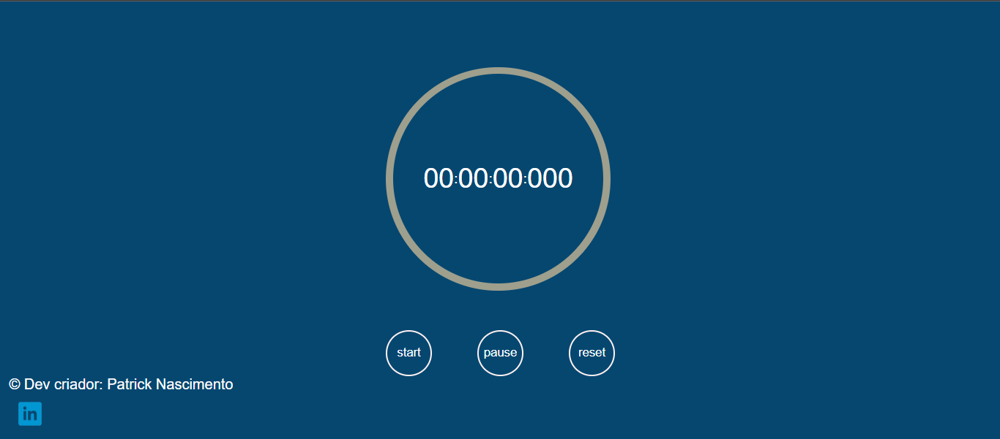

# StopWatch
- Cronômetro feito em HTML, CSS e JavaScript, foi feito para melhoria de porfólio

## Screenshots

Cronômetro no navegador

## Aprendizados

    Projeto de criação de um cronômetro 
    na web utilizando HTML-5(linguagem de demarcação da web)
    e CSS(folha de estilos) e útilizando a LP JavaScript.

    Fazendo esse projeto eu consegui melhor um pouco a minha
    lógica de programação, na construção do script feito em
    JavaScript em ligação das funções do JavaScript para o Html
    mostrando na tela para o serve client.

    
## Feedback

Se você tiver algum feedback, por favor nos deixe saber por meio do meu linkedin 

## Referência

## Etiquetas

